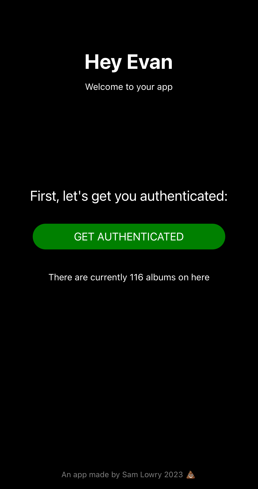
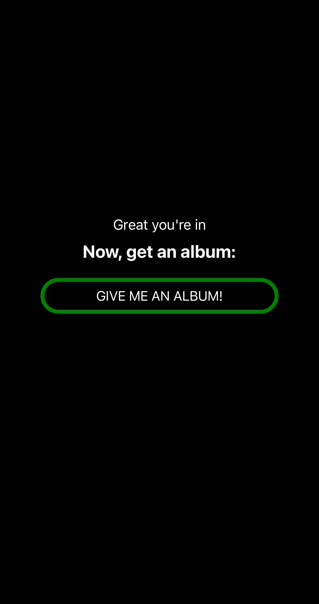
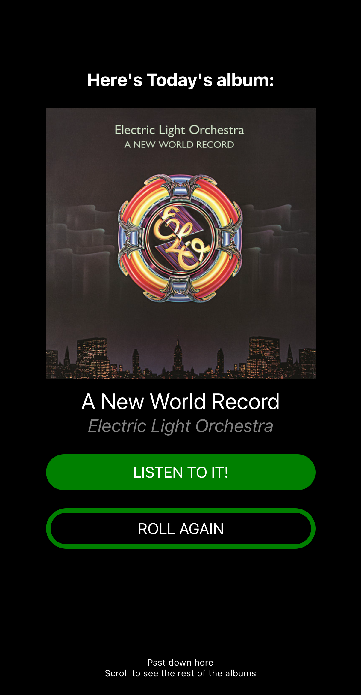
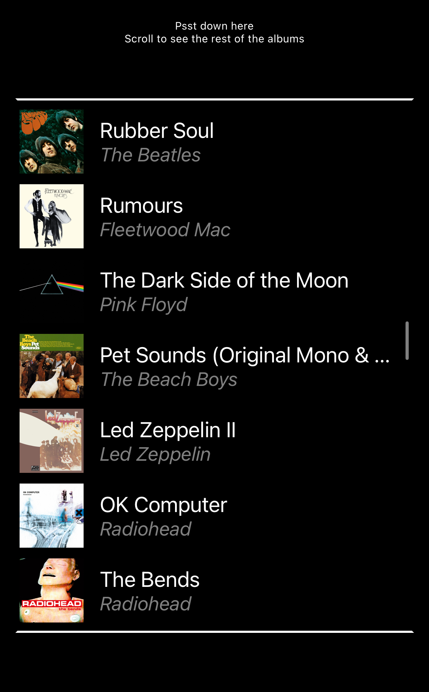
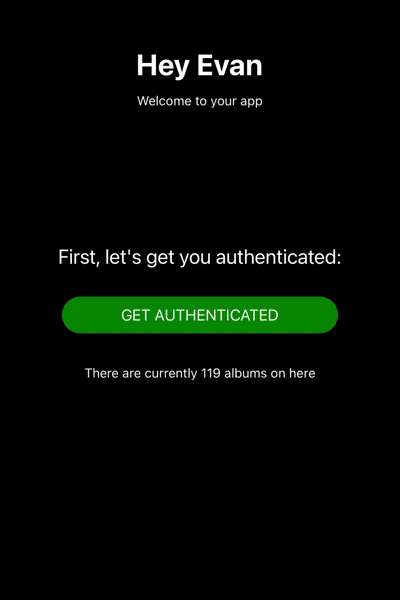

## An app about music for my friend Evan
*Built so he can listen to a new album on his rides to work.
Basically, it accesses the Spotify API to retreive album information*

To run on simulator: 
- `$ npx react-native start`
- (Then press which option for simulator)

To install on iPhone:
1. Open project in XCode by selecting the .workspace file (inside of ios folder)
2.  Connect iPhone via cord
3. Click `Run` from the Project dropdown

  
  
  
  
  
  
  

*Written by Sam Lowry, 2023 using React-Native*
